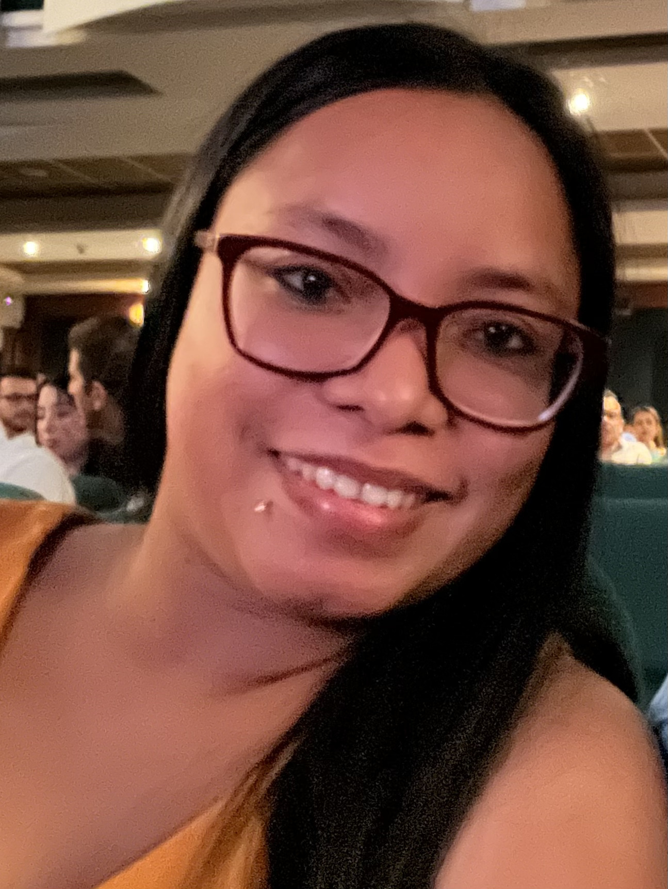

# Grupo1-GatoCurioso

## Adrian Anaya L

## Rol
Arte y Diseño

## Ubicación
Cartagena

## Perfil
Actualmente me encuentro cursando el programa de Ingenieria Multimedia. Cuento con experiencia laboral en diseño. En mi carrera espero mejorar mis habilidades en diseño interactivo, modelado en 3d y desarrollo de videojuegos.

---

## Juan

**Rol:** Editor De videos y animaciones (beta tester)    
**Ubicación:** Valledupar, Cesar  
**Perfil:**  
Tecnólogo en producción multimedia, con experiencia laboral en edición de vídeo y realizar animaciones, conocimientos en adobe suit, con creatividad e innovación con habilidades para el trabajo en equipo. Actualmente estudiando una carrera profesional llamada Ingeniera Multimedia en la que desarrollo mi conocimiento de diseño interactivo, desarrollo, sonido, de los videojuegos.

---

## Floraime

**Rol:** QA Engineer (Software Tester)  
**Ubicación:** Barranquilla, Atlántico  
**Perfil:**  
Actualmente me encuentro trabajando como QA Engineer, realizando pruebas a aplicaciones fitness para iOS, Android y plataformas web. Mi labor se enfoca en garantizar la calidad del producto, identificar errores y mejorar la experiencia del usuario en diferentes dispositivos y entornos. Además, estudio Ingeniería Multimedia, donde desarrollo habilidades en diseño interactivo, experiencias digitales y desarrollo de videojuegos.
